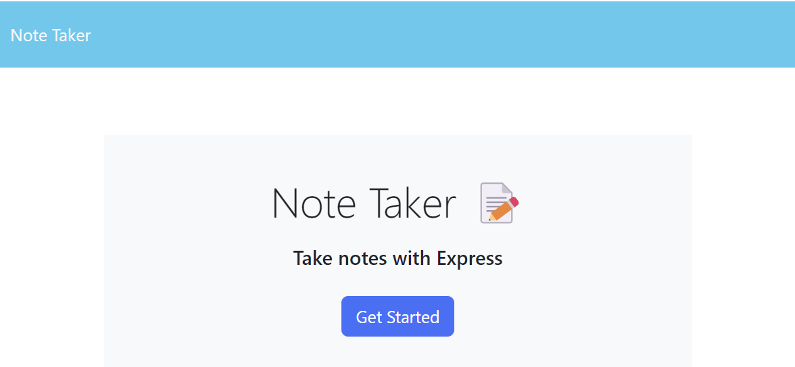
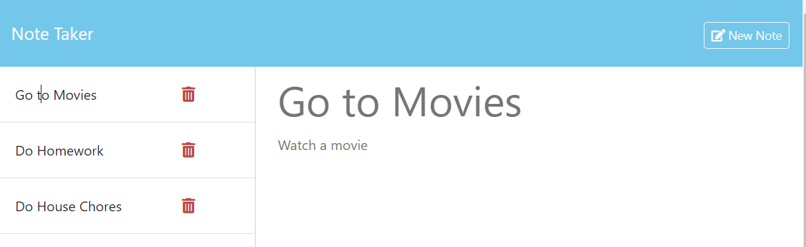

# Module 11: Note Taker

## Summary
In this challenge, we'll build a (Note Taker) application that will use Express.js as its backend services.  The applciation allows the user to create a new note and save it to storage so that it may be displayed when it's selected on the frontend UI.  The storage in this case is a flat file named (db.json) that includes all the notes that have previously been saved by the user.

The additional and specific features of this application, along with the user interactions, are outlned in the following section.

## Features and Application Behavior
1. The landing page for the application includes a link that directs the user to the notes page

2. The notes page displays all the existing (previously saved) notes in the left-hand column, plus an empty field to enter a new note title and note’s text in the right-hand column

3. When the user enters a new note title and the note's text, the "Save Note" button and "Clear Form" button appear in the navigation at the top of the page

4. When the user clicks on the "Save" button, the note is saved and appears in the left-hand column with the other existing notes and the buttons in the navigation disappear

5. When the user clicks on an existing note in the list in the left-hand column, the note appears in the right-hand column and a new "New Note" button appears in the navigation

6. When the user clicks on the "New Note" button in the navigation at the top of the page, the user is presented with empty fields to enter a new note title and the note's text in the right-hand column and the button disappears

## Hosting of the Application
Given that the application includes backend services, it will be deployed and hosted on (render.com).

## Screenshots of the Application

